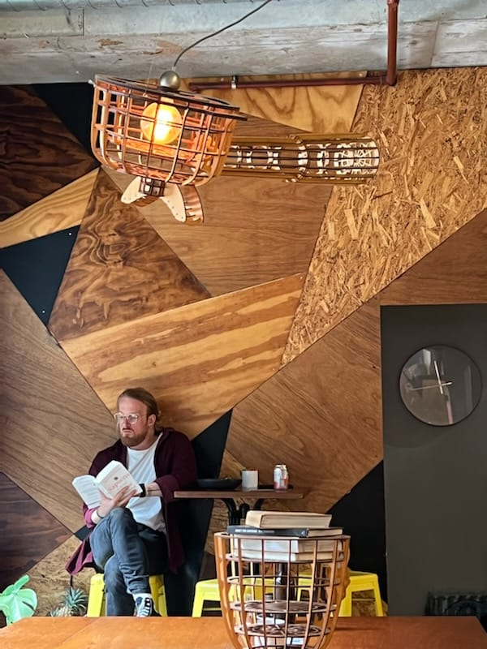

<p align="center">

</p>
<p style="font-family: Times-New-Roman">
It seems like only a few months ago I was sitting with a coffee, contemplating whether I should embark upon this coding bootcamp. Now I sit here with a new career path in front of me and a fascinating new hobby to boot! Here's where I've been and what I'm doing.
</p>

### **Where have I been?**
I have spent the last 18 odd years working in hospitality, making a career out of making people have a good time. This is probably the most relevant aspect of my former career: I genuinely care about making sure people have the best experience possible. I began a Full Stack Web Development bootcamp in March 2022 and throughout that time have learned a lot not only about coding, but about source control, project management and task delegation methodology.
This bootcamp admittedly tested not only my sincereity but my overall grit. At stages throughout I was working 3 jobs _plus_ volunteering at a local community kitchen. It has certainly been a ride but now, diploma in hand, I am free to extricate myself from these circumstances and pursue coding full-time.

### **Where a I now?**
 No more teachers, no more books! It's autonomous learning form here on as well as practice, practice, practice. I'm currently educated in:  
 - HTML/CSS
 - Python (inc. Flask)
 - Javascript (inc. React, Express, mongoose)
 - NodeJS (inc Jest, Supertest)
 - PostgreSQL
 - MongoDB
as well as having now had experince with VSCode, Postman, Trello and Github in a more administrative/testing context.

### **Where am I headed?**
I was told early on that when you graduate you ahve three choices. You can go and get a job that provides great mentoring, really interesting work or substantial money. At best you can two out of three.
That is the order of my priorities for now. While I have learned a lot I know that there is still a long road to travel and I a looking for a role that will help me learn not just the code but the processes and problem solving abilities that are required to be an exceptional developer.  
Of course interesting work is a bonus if I can get it.
Money will come. It always does eventually.

So that's my intention. On a more specific note I have _thoroughly_ enjoyed working on backends, particularly using express and nodeJS. I think that may be more to do with the simplistic course content covered when learning Python though as after some consideration it is the problem solving I enjoy so much.

I don't have many projects/repositories at this stage. I removed the incidental ones (for example learning github) and while my repo may have the backend of the Shkr app, I have not pushed the frontend as I had very little input. That, and my project hwile looking for work is to revise the frontend. While I do think it's a viable idea for an app, this is more an exercise of just practice, repitition and exploring where I can take an idea if I am not constantly checking on a rubric and peing pressed for time.

### **Where to reach me?**
Obviously github. 
There is a static portfolio website created as my assignment to illustrate my understanding of HTML and CSS under the repo: Portfolio. Failing that my contact details are as follows:
```
const patrickHamer = {
    github: "https://github.com/Patrick655321",
    linkedin: "https://www.linkedin.com/in/hamerpatrick86/",
    email: "hamerpatrick86@gmail.com"
} 
```


 
<!--
**Patrick655321/Patrick655321** is a ✨ _special_ ✨ repository because its `README.md` (this file) appears on your GitHub profile.

Here are some ideas to get you started:

- 🔭 I’m currently working on ...
- 🌱 I’m currently learning ...
- 👯 I’m looking to collaborate on ...
- 🤔 I’m looking for help with ...
- 💬 Ask me about ...
- 📫 How to reach me: ...
- 😄 Pronouns: ...
- ⚡ Fun fact: ...
-->
